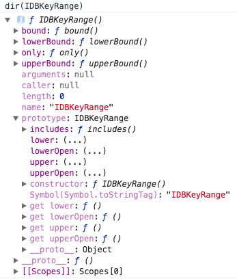

# indexedDB

## 预习
- [IndexedDB：浏览器端数据库](http://javascript.ruanyifeng.com/bom/indexeddb.html)
- [使用 IndexedDB](https://developer.mozilla.org/zh-CN/docs/Web/API/IndexedDB_API/Using_IndexedDB)
- [HTML5 进阶系列：indexedDB 数据库](https://zhuanlan.zhihu.com/p/26639553)
- [Working with IndexedDB](https://developers.google.com/web/ilt/pwa/working-with-indexeddb)
- [HTML5 indexedDB前端本地存储数据库实例教程](http://www.zhangxinxu.com/wordpress/2017/07/html5-indexeddb-js-example/)

> 学完后需要将张鑫旭的实例自己实战一番。否则会很懵逼。

## 总结

浏览器处理能力不断增强，越来越多的网站考虑将大量数据存在客户端。但是cookie和localStorage都不适合储存大量数据。

**1. indexeddb的特点？**

- 键值对存储，值可以是js对象;键是独一无二的，重复则报错。
- 异步读写，而localStorage是同步的。
- 支持事务：只要有一步失败，则整个事务取消。不存在只改写一部分数据的情况。
- 同域限制
- 存储空间大：一般不小于250m，chrome和opera是剩余空间的某个百分比，firefox没有上限。
- 支持二进制存储

**2. 几个概念**

**2. indexedDB简介？**

indexedDB是一个全局对象，它是IDBFactory的实例。


可以看到，它有三个方法：cmp、deleteDatabase、open。

cmp用于比较两个键的大小，-1表示小于，0表示相等，1表示大于。

```javascript
indexedDB.cmp('a', 'b') // -1
indexedDB.cmp('a', 'a') // 0
indexedDB.cmp('ade', 'abc') // 1
```

open、deleteDatabase分别表示请求连接数据库和请求删除数据库。注意只是请求，和ajax的send方法一样，都是异步的。

**3. 创建数据库**

创建数据库使用open方法。

```
var openRequest = indexedDB.open('test', 1)
```

open方法有2个参数：第一个参数是数据库名称，第二个参数是数据库的版本号，如果不传，默认是1。如果数据库不存在，则会新建数据库。

open方法返回一个IDBOpenDBRequest对象。


上图可以看到，openRequest 有四个事件函数，分别是：

- onblocked：表示连接时，如果上次数据库连接还未关闭时触发
- onerror：打开数据库失败时触发
- onsuccess：打开数据库成功时触发
- onupgradeneeded：新建数据库或数据库版本升级时触发

下面是一个稍微完整的连接数据库的例子。

```javascript
var openRequest = indexedDB.open('test', 1)

openRequest.onsucess = function(e){
    console.log('onsucess')
    console.log('连接的数据库对象是db:', e.target.result)
}
openRequest.onerror = function(){
    console.log('onerror')
}
openRequest.onupgradeneeded = function(){
    console.log('onupgradeneeded')
}
```

上面的代码中，可以通过 e.target.result获取连接的数据库对象。

**4. 新建对象仓库**

在关系型数据库里，数据库建好后，就需要建表了。但是indexedDB里不叫表，叫"对象仓库"，其实它类似于表。

通过db.createObjectStore()可以创建对象仓库，如果对象仓库已经存在，会抛出一个错误。为了避免错误需要用db.objectStoreNames的contains方法来检测仓库是否存在。

```javascript
var openRequest = indexedDB.open('test', 1)

openRequest.onupgradeneeded = function(e){
    var db = e.target.result
    if(!db.objectStoreNames.contains('firstOS')){
        db.createObjectStore('firstOS', {autoIncrement: true})
    }
}
```

> 只能在onupgradeneeded事件里使用createObjectStore。如果在onsucess里使用createObjectStore，会报错`Failed to execute 'createObjectStore' on 'IDBDatabase': The database is not running a version change transaction`。

上面的代码，在onupgradeneeded事件里创建了一个名叫firstOS的对象仓库。onupgradeneeded事件是在新建数据库或数据库版本改变时触发，所以如果数据库存在，新建对象仓库时，必须增加版本号。

db.objectStoreNames返回一个DOMStringList对象，包含数据库所有对象仓库的名称。它的contains方法，可以检查数据库是否包含某个“对象仓库”。

db.createObjectStore()方法接受有2个参数，第一个是对象仓库的名称，第二个是键名的特征，keyPath指定用那个字段做键名，默认是null;autoIncrement表示以自动递增的整数做键名，默认是false。一般来说，keyPath和autoIncrement属性只要使用一个就够了，如果两个同时使用，表示键名为递增的整数，且对象不得缺少指定属性。

5. 操作数据

操作数据分为读、写、修改、删除数据。要操作数据，必须首先使用transaction()方法创建数据库事务。

```
var t = db.transaction(["firstOS"], "readwrite");
var store = t.objectStore("firstOS");
```

transaction()方法第一个参数是涉及的对象仓库数组，通常只有一个。第二个参数是表示操作类型的字符串，目前只支持readonly(读时用)和readwrite(写时用)两种。

transaction()也是异步的，。

```
abort：事务中断。
complete：事务完成。
error：事务出错。
```

要注意的是，在onupgradeneeded里面可以直接获取transaction，不能新建，否则报错。

```
openRequest.onupgradeneeded = function (e) {
	var db = e.target.result
	if (!db.objectStoreNames.contains("firstOS")) {
	    db.createObjectStore("firstOS");
	}

    // 错误：会抛出下面的错误
	// var transaction = db.transaction(['firstOS'], 'readwrite')

	// 正确
	var transaction = e.target.transaction
}
```


所以为了让代码清晰点，通常是在onupgradeneeded里创建对象仓库，在onsuccess里操作数据。

```
openRequest.onupgradeneeded = function (e) {
	var db = e.target.result
	if (!db.objectStoreNames.contains("firstOS")) {
	    db.createObjectStore("firstOS");
	}
}
openRequest.onsuccess = function (e) {
    console.log('Success', e.target)
    var transaction = e.target.result.transaction(['firstOS'], 'readwrite')
    var store = transaction.objectStore('firstOS');
    store.add({p: 123}, 1)
         .onsuccess(function(){
            console.log('添加数据成功')
         })
}
```

通过store对象可以操作数据，下面看store的几个方法：

- add(obj, key)：添加数据，key表示键名，如果创建数据仓库时设置了键，则可以不指定
- get(key)：通过key获取数据
- delete(key)：通过key删除数据
- openCursor()：创建一个指针，用于遍历数据仓库。
    - 第一个参数是一个Range对象，表示遍历的范围，需要通过IDBKeyRange创建，后面有介绍。
    - 第二个参数，表示遍历方向，默认值为next，其他可能的值为prev、nextunique和prevunique。后两个值表示如果遇到重复值，会自动跳过。

注意它们都是异步的，有onsuccess和onerror事件，下面是用法的实例：

```
// 添加数据：add()
var store = t.objectStore("firstOS");
var o = {p: 123};
var request = store.add(o,1);  // 1表示键名，如果创建数据仓库时，设置了键，则可以不指定
request.onerror = function(){}
request.onsuccess = function(){}

// 获取数据：get()
var t = db.transaction(["firstOS"], "readonly");
var store = t.objectStore("firstOS");
var ob = store.get(1);
ob.onsuccess = function(e){
    console.log(e.target.result) // {p: 123}
}

// 更新数据
var o = { p:456 };
var request = store.put(o, 1);

// 删除数据
var t = db.transaction(["people"], "readwrite");
var request = t.objectStore("people").delete(1);

// 遍历数据
var t = db.transaction(["test"], "readonly");
var store = t.objectStore("test");
var cursor = store.openCursor();  // 创建一个指针
cursor.onsuccess = function(e) {
    var res = e.target.result;
    if(res) {
        console.log("Key", res.key);
        console.dir("Data", res.value);
        res.continue(); // 指针向后移动，如果已经是最后一个，则光标执行null
    }
}

// 链式写法
db.transaction(["test"], "readonly")
  .objectStore("test")
  .get(X)
  .onsuccess = function(e){}
```

创建索引和读取数据
```
var store = db.createObjectStore("people", { autoIncrement:true });

store.createIndex("name","name", {unique:false});
store.createIndex("email","email", {unique:true});

var t = db.transaction(["people"],"readonly");
var store = t.objectStore("people");
var index = store.index("name");

var request = index.get(name);
```

6. 关于索引

索引的作用：
- 索引就像表的字段，用于数据的操作
- 指定读取数据的范围，可以通过IDBKeyRange对象创建Range对象。

下面是一个使用索引的例子：

```
var index = objectStore.index("name");
index.get("Donna").onsuccess = function(event) {
  alert("Donna's SSN is " + event.target.result.ssn);
};
```

Donna可能不止一个，它总是会获取键值最小的那个。

```
index.openCursor().onsuccess = function(event) {
  var cursor = event.target.result;
  if (cursor) {
    // cursor.key 是一个 name, 就像 "Bill", 然后 cursor.value 是整个对象。
    alert("Name: " + cursor.key + ", SSN: " + cursor.value.ssn + ", email: " + cursor.value.email);
    cursor.continue();
  }
};

index.openKeyCursor().onsuccess = function(event) {
  var cursor = event.target.result;
  if (cursor) {
    // cursor.key 是一个 name, 就像 "Bill", 然后 cursor.value 是那个 SSN。
    // 没有办法可以得到存储对象的其余部分。
    alert("Name: " + cursor.key + ", SSN: " + cursor.value);
    cursor.continue();
  }
};
```

IDBKeyRange对象的作用是生成一个表示范围的Range对象。



它有四个方法可以生成Range，分别是:
- lowerBound()：指定范围的下限
- upperBound()：指定范围的上限
- bound():指定范围的上下限
- only：指定范围只有一个值

```
// 小于3，第二个参数true表示不包含等于，默认是false，表示<=3
// IDBKeyRange{lower: undefined, lowerOpen: true, upper : 3, upperOpen: true }
var r1 = IDBKeyRange.upperBound(3, true)

var r6 = IDBKeyRange.bound(x, y, true, true);

// 只有3
// {lower: 3, upper: 3, lowerOpen: false, upperOpen: false}
var r2 = IDBKeyRange.only(3)
```

可以用Range对象作为openCursor()方法的参数，读取指定范围的数据。

```
var t = db.transaction(["people"],"readonly");
var store = t.objectStore("people");
var index = store.index("name");

var range = IDBKeyRange.bound('B', 'D');

index.openCursor(range).onsuccess = function(e) {
    var cursor = e.target.result;
    if(cursor) {
        console.log(cursor.key + ":");
        for(var field in cursor.value) {
            console.log(cursor.value[field]);
        }
        cursor.continue();
    }
}
```

常用的存储库：

- [localForage](https://github.com/localForage/localForage)

## 深入学习

- [mdn IndexedDB API](https://developer.mozilla.org/zh-CN/docs/Web/API/IndexedDB_API)
- [w3 indexedDB](https://www.w3.org/TR/IndexedDB-2/)


