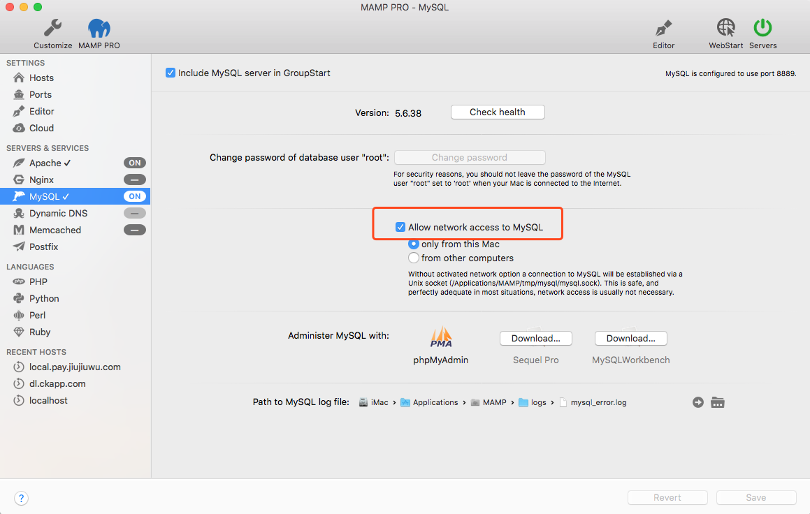

# API构建

## 安装

首先按照mysql，再安装[mysql连接器](https://github.com/mysqljs/mysql#readme)，提供了操作数据库的接口

```bash
npm i mysql
```

## 连接mysql报错

**1、connect ECONNREFUSED 127.0.0.1:3306**

mamp 的 mysql端口是 8889 了，另外，需要开启`Allow network access to Mysql`。



**2、Access denied for user 'root'@'localhost' (using password: NO)**

重置一下root的密码

## 操作mysql的方式


1、通过sql语句

```javascript
var mysql = require('mysql')

var connection = mysql.createConnection({
    host: 'localhost',
    port: '8889',
    user:'',
    password:'',
    database: ''
})

connection.connect(function(err){
    if(err){
        console.error(err.stack)
        return
    }

    connection.query('SELECT * FROM blogs', function(err, result){
        if(err) throw err

        console.log(result)

        connection.end()
    })
})
```

sql注入安全问题


2、通过ORM方式

`Object Relational Mapping`。通过操作对象的方式操作数据库。

优点：
1. 不用写sql语句，在工具层防止sql注入
2. 屏蔽底层操作，提升开发效率和可维护性

确定：
1. 复杂场景，性能不如sql
1. 很难做性能调优
1. 对于复杂查询很无力

通过Sequelize库

```
npm install sequelize
npm install mysql2
```

提供数据接口

接口设计
get和post请求处理

使用连接池
频繁开启关闭链接可能造成性能问题或达到链接上线。

连接池

优点
资源重用
更快响应速度
统一连接管理，避免数据库连接泄露
更好的资源分配

mysql和sequelize都默认支持。

```
mysql.createPool({

})
```


## 进程管理

### 利用多核CPU
一个核运行一个进程。


### 守护进程

在实际的生产环境的Web服务器都是以多进程方式的，目的除了可以提高处理请求的并发能力，另外就是可以管理web服务进程，当出现异常时，程序可以发现并重启新的web服务进程来继续服务，保障服务的健壮和稳定。

守护进程因为是负责创建和管理工作进程的，所以不要实际处理请求，要保证尽量不出现异常，如果守护进程都出现异常了就只能人工重启服务或通过第3方程序来定时发现并重启了。

