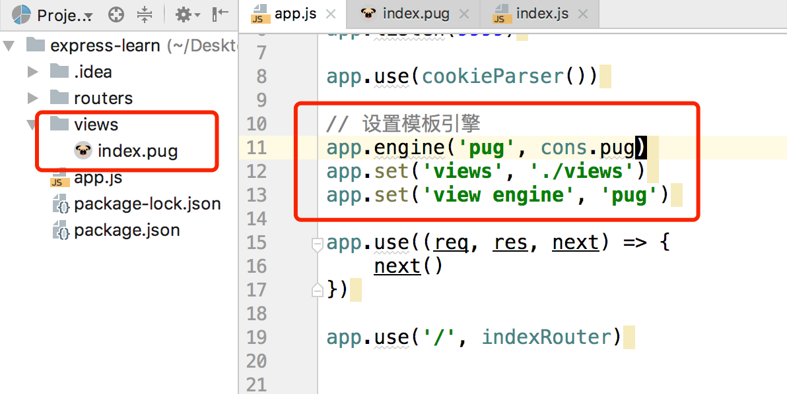

# pug(原jade)模板引擎

## 学习资料

- [如何看待模板引擎 Jade 改名为 Pug？](https://www.zhihu.com/question/46418330)
- [Pug 中文文档](https://pug.bootcss.com/language/attributes.html)
- [Pug github](https://github.com/pugjs/pug)
- [jade官方文档(npm已经不维护了)](http://jade-lang.com/)

> 自己将pug中文文档里面的例子都试试

## 总结

**1. 如何使用pug?**

```
// 默认express-generator生成的代码
app.set('views', './views')
app.set('view engine', 'jade')
```

express-generator默认采用的jade，官方说以后会换成pug，所以使用pug就行了。

要切换成pug，需要使用[consolidate.js](https://github.com/tj/consolidate.js)。

```
// 首先安装库
npm i consolidate
npm i pug

// 使用
const cons = require('consolidate')
app.engine('pug', cons.pug)
app.set('views', './views')
app.set('view engine', 'pug')
```

当然，编写的模板文件后缀也改成`.pug`结尾。



**2. 属性Attribute的一些特殊问题？**

a). 管道符| 用于控制空格，2个换行的|表示一个空格(最多一个空格)，只写一个不行，写多了也只有一个空格。

```
a(href='baidu.com') 百度
|   // 没有空格
a(class='button' href='baidu.com') 百度
|   // 这里有一个空格
|
a(class='button', href='baidu.com') 百度
|   // 这里还是只有一个空格，写多了没有用
|
|
|
a(class='button', href='baidu.com') 百度
```


**3. 遍历**

可以遍历数组、对象

```
// 1、遍历数组
ul
  each val, index in ['〇', '一', '二']
    li= index + ': ' + val


- var values = [];
ul
  each val in values.length ? values : ['没有内容']
    li= val

- var values = [];
ul
  each val in values
    li= val
  else
    li 没有内容

// 2、遍历对象
ul
  each val, index in {1:'一',2:'二',3:'三'}
    li= index + ': ' + val


```