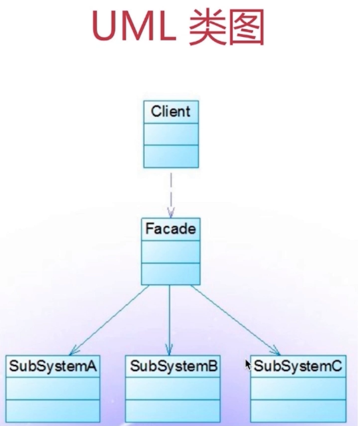

# 外观模式

## 说明

为子系统的一组接口提供一个高层接口，使用者使用这个高层接口。





## 场景

比如传几种参数。

```javascript
function bindEvent(elem, type, selector, fn){
    if(fn == null){
        fn = selector
        selector = null
    }
}

// 调用
bindEvent(elem, 'click', '#div1', fn)
bindEvent(elem, 'click', fn)
```

## 总结

不符合单一职责原则和开发封闭原则。因此谨慎使用，不可滥用。


- [学用 JavaScript 设计模式](http://www.oschina.net/translate/learning-javascript-design-patterns)
