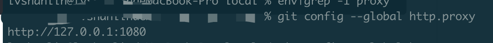
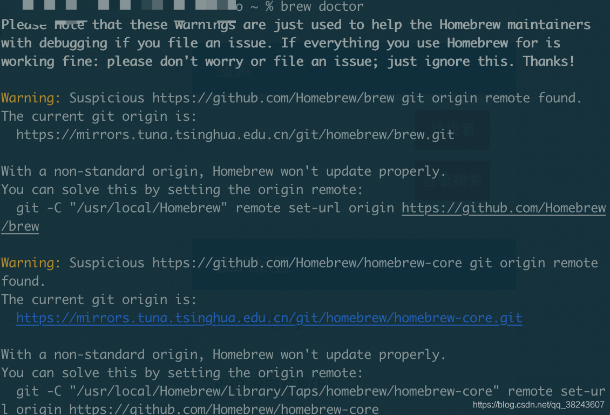

# brew 

## `initialize': Version value must be a string; got a NilClass () (TypeErro

运行

```
brew update-reset 
```

## fatal: unable to access 'https://mirrors.ustc.edu.cn/brew.git/': Failed to connect to 127.0.0.1 port 1080: Connection refused

1、查看 git 是否有代理，有则取消后，再执行命令

```
git config --global http.proxy
```

有代理会打印 



2、取消代理

```
git config --global --unset http.proxy
```

## curl: (7) Failed to connect to raw.githubusercontent.com port 443: Connection refused

在安装和使用命令brew update时，会出现上面的错误，原因是目前 GitHub 的 gist 访问不了，所以获取不到安装的脚本文件。

运行下面的脚本

```sh
/bin/zsh -c "$(curl -fsSL https://gitee.com/cunkai/HomebrewCN/raw/master/Homebrew.sh)"
```

## brew doctor



仔细查看警告，可以发现已经给出了解决办法，也就是：you can solve 后面的内容，直接复制粘贴执行，即可解决。
