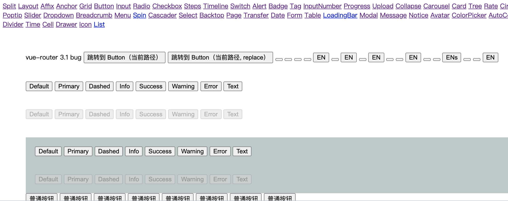

# 搭建整体框架

## 复制 webpack配置和依赖文件

1. 将 build 目录和 package.json 里的依赖复制过来，先让环境能够跑起来。build 目录里是 webpack 的配置文件。

2. npm i 安装依赖。

3. 将 npm script 的 dev 脚本复制到 package.json 中。

```json
{
  "dev": "webpack-dev-server --content-base test/ --open --inline --hot --compress --history-api-fallback --port 8081 --config build/webpack.dev.config.js"
}
```

examples 目录里是一个 vue 项目，里面编写了各个组件的一些例子，方便调试。而 npm run dev 会启动一个 examples 项目。我们可以一边在 src 里写 ui 组件代码，一边预览效果。

## 入口文件

iview 的入口文件是 `src/index.js`，主要内容如下：

### 组件的导入和导出

```js
...
import Button from './components/button';

const components = {
    Button,
    ...
};

const iview = {
    ...components,
    iButton: Button,
    iCircle: Circle,
    iCol: Col,
    iContent: Content,
    iForm: Form,
    ...
};

const API = {
    version: process.env.VERSION,
    locale: locale.use,
    i18n: locale.i18n,
    install,
    Circle,
    Switch,
    ...components
};

API.lang = (code) => {
    const langObject = window['iview/locale'].default;
    if (code === langObject.i.locale) locale.use(langObject);
    else console.log(`The ${code} language pack is not loaded.`);
};

module.exports.default = module.exports = API;
```

可以看到它导出了一个 API 对象，下面挂载了所有的组件，还包括国际化的 i18n、install 方法和 version 版本号。

process.env.VERSION 打包时是怎么处理的？会转成字符串吗？

要注意的是对于 Button、Circle、Col、Form 等组件，由于 html/svg 也有这些组件，所以改了下名字，加上了前缀 i，如 Button 变成了 iButton。

### install 方法

install 方法在 Vue.use 时会自动调用。iview 的 install 方法主要做了 3 件事情：

1. 使用 Vue.component 注册组件。
2. 给 Vue 实例添加 `$IVIEW` 属性
3. 给 Vue 实例添加一个 API 组件，如 $Loading、$Message 等，这样就可以直接通过 `this.$Message.info()`来调用

```js
const install = function(Vue, opts = {}) {
  if (install.installed) return;
  locale.use(opts.locale);
  locale.i18n(opts.i18n);

  Object.keys(iview).forEach(key => {
      Vue.component(key, iview[key]);
  });

  Vue.prototype.$IVIEW = {
      size: opts.size || '',
      transfer: 'transfer' in opts ? opts.transfer : '',
      capture: 'capture' in opts ? opts.capture : true,
      ...
      modal: {
          maskClosable: opts.modal ? 'maskClosable' in opts.modal ? opts.modal.maskClosable : '' : ''
      }
  };

  Vue.prototype.$Loading = LoadingBar;
  Vue.prototype.$Message = Message;
  Vue.prototype.$Modal = Modal;
  Vue.prototype.$Notice = Notice;
  Vue.prototype.$Spin = Spin;
};

if (typeof window !== 'undefined' && window.Vue) {
  install(window.Vue);
}
```

## Vue.use 源码

```js
Vue.use = function(plugin) {
  if (plugin.installed) {
    return;
  }
  // 给 install 方法注入 Vue 参数
  var args = toArray(arguments, 1);
  args.unshift(this);
  if (typeof plugin.install === "function") {
    plugin.install.apply(plugin, args);
  } else if (typeof plugin === "function") {
    plugin.apply(null, args);
  }
  plugin.installed = true;
  return this;
};
```

## 总结

今天搭建了项目整体框架:

- 开发环境
- 组件 button 和 message 模版，没写具体内容。
- 入口文件 `src/index.js`
- examples 复制过来，只保留 button 路由，去掉 main 里面的国际化语言。

有了这些后，运行 npm run dev，项目就可以跑起来了，点击 button 路由，效果如下图。


