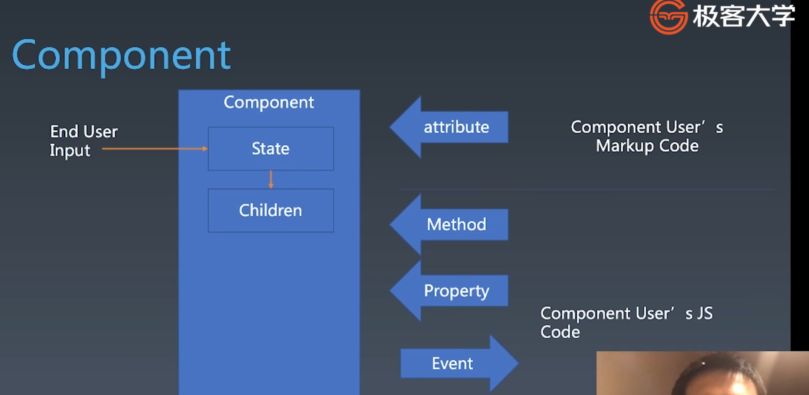
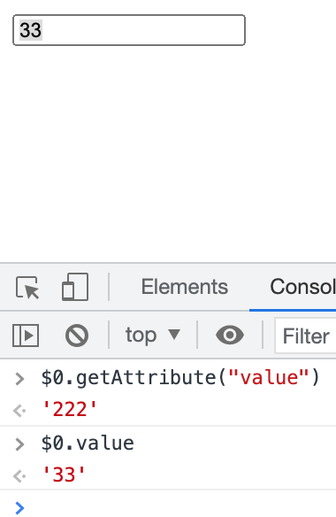
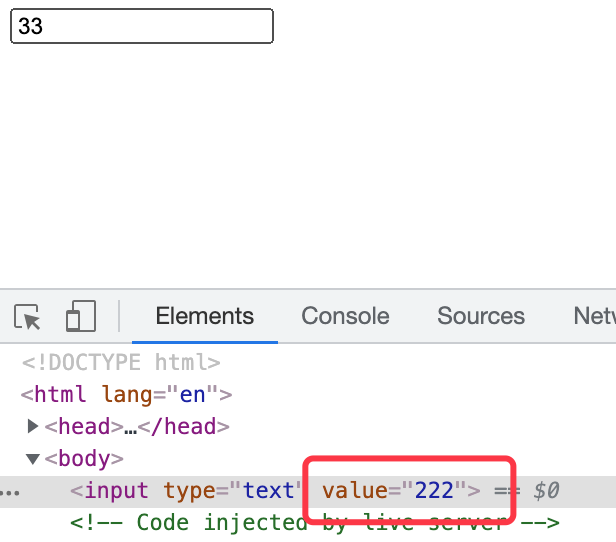

# 组件化基础

对象

-   Properties
-   Methods
-   Inherit

组件

-   Properties
-   Methods
-   Inherit
-   Attribute
-   Config & State
-   Event
-   Lifecycle
-   Children



## Attribute vs Property

-   Attribute 强调描述性，如人身高，漂亮
-   Property 强调从属关系，如人胳膊

```
Attribute: html 和 js 都可以设置
<my-component attribute="v">
myCom.getAttribute(key)
myCom.setAttribute(key, value)

Property: js 可以设置
myCom.key = value
```

区别：

-   名字不一样，如 html attr: class, dom 是 className
-   style 属性,html 里是字符串, dom 是 style 对象
-   href

```
<a href="//m.taobao.com">
a.href // https://m.taobao.com, 是 resolve 过的结果
a.getAttribute("href") // // 'm.taobao.com' 和 HTML 代码一致
```

-   input 的 value 属性这个 attribute 像是一个默认值，一旦改变 prop 或者手动输入值(相当于改了 prop), attribute 就失效了。



上图中，初始 value attribute 为 222, 手动修改为 33 后,value attribute 没有变化。



React 是让 attribute 和 property 一致。要看设计的时候是否想让它们是一个东西。

## 如何设计组件状态

```
            Markup set | Js set | Js Change | User Input Change
property        n          y         y                 ?
attribute       y
state                      y         y
Config                                                  y
```

## Lifecycle


## Children

-   Content 型 Children
-   Template 型 Children

```
// Content 型
<m-button>hello</m-button>

// Template 型, 自动遍历 data 里的数据
<m-list data>
    <li></li>
</m-list>
```

## Carousel

**Carousel**

-   state
    -   activeIndex
-   property / config
    -   loop/time/imglist/autoplay/color/forward
-   attribute
    -   startIndex // 和 value 逻辑一致, 只用一次, 不需要在 property 里有
    -   loop/time/imglist/autoplay/color/forward
-   children
-   event
    -   change
    -   click
    -   hover
    -   swipe
    -   resize (x)
-   method
    -   next()
    -   prev()
    -   goto()
    -   play() ? 可以通过 autoplay 设置
    -   stop() ?
-   config
    -   mode: useRAF useTimeout? setInterval(tick, 16) / setTimeout / requestAnimationFrame

**CarouselView**
