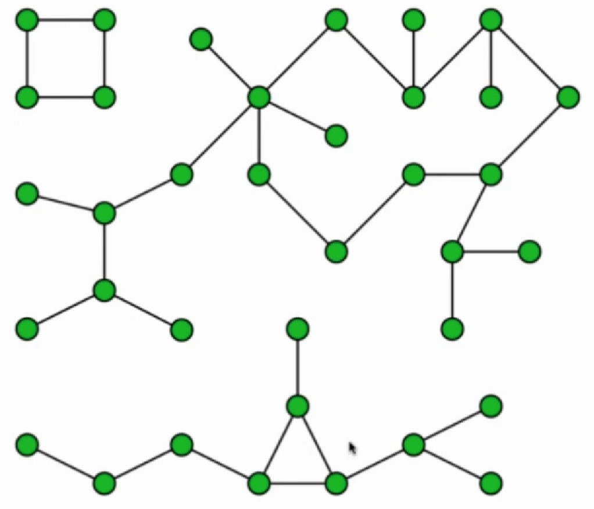
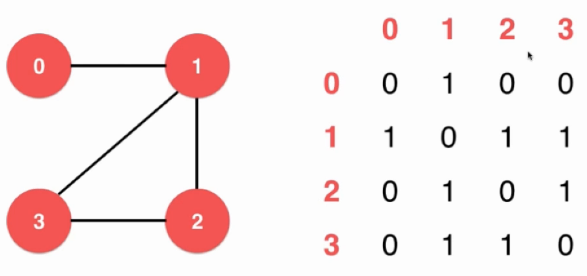
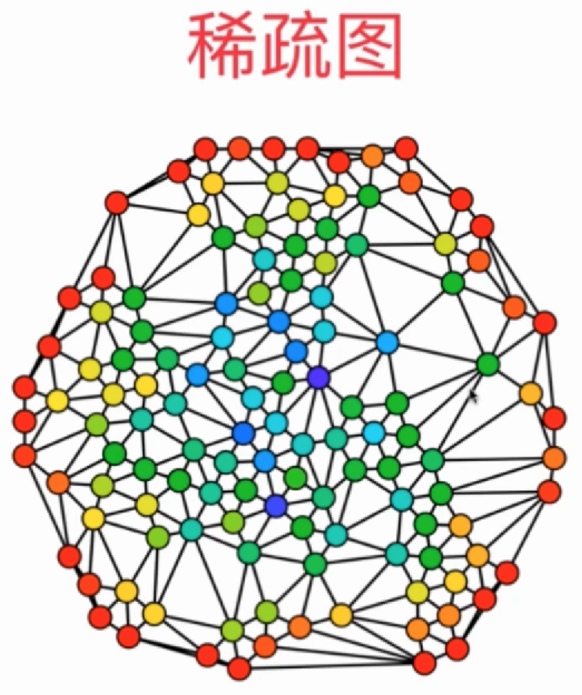
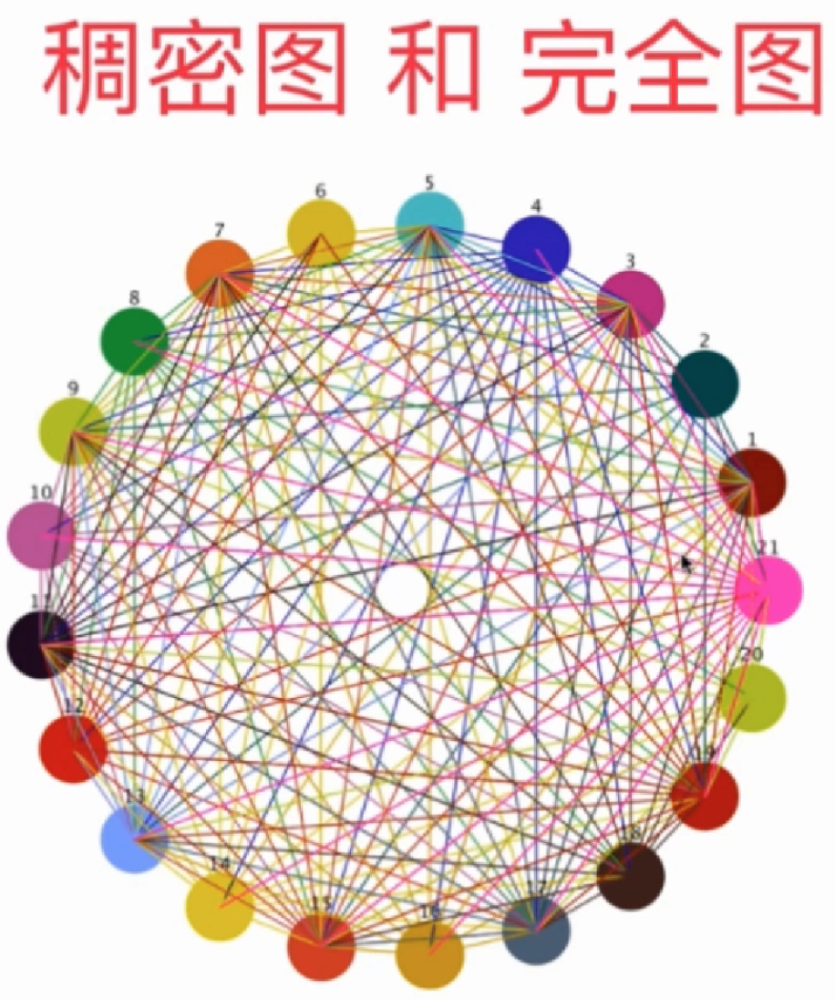

# 图的基础

## 概念

图论(Graph Theory)：研究由点、边构成的一种数据模型的学科。

概念

- 点
- 边
  - 有向图
  - 无向图
- 权重
  - 有权图
  - 无权图
- 图的连通性：节点不一定都被连接起来
  
- 简单图(Simple Graph): 没有自环边和平行边
  - 自环边(self-loop)
  - 平行边(parallel-edges): 比如两个城市的道路
    

## 图的表示

图的表示通常有 2 种方法：

- 邻接矩阵(Adjacency Matrix)

表示无向图

表示有向图

- 邻接表(Adjacency Lists)
  
  
  

稀疏和稠密可以通过边的多少和最大边数量来判断。

