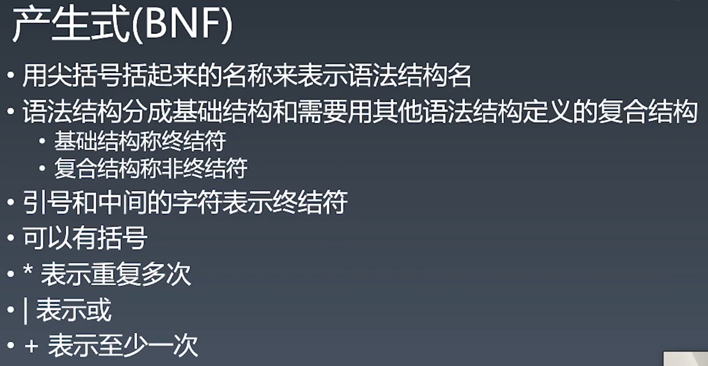
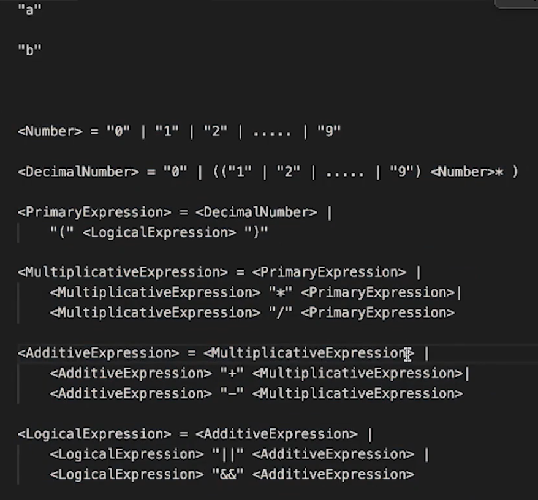
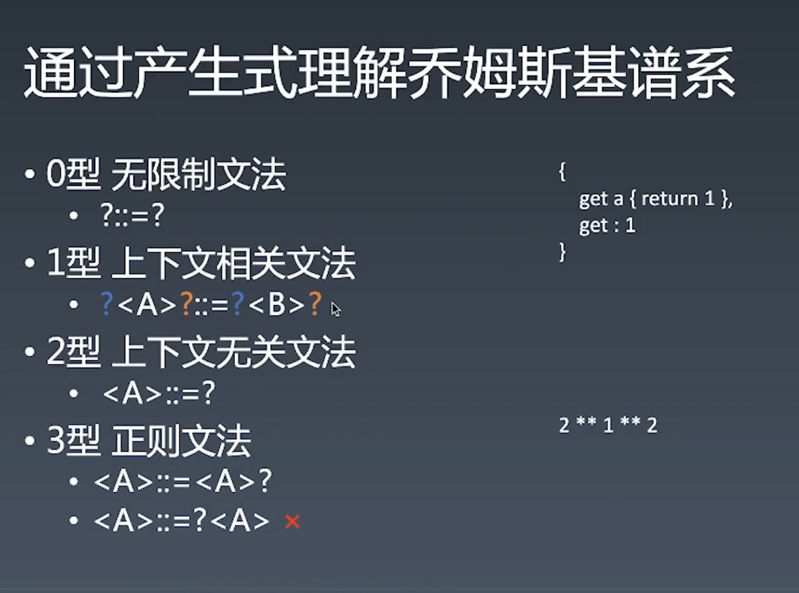

# 编程语言通识

## 语言按语法分类

非形式语言：中文、英文
形式语言(乔姆斯基谱系)

- 0 型 无限制文法
- 1 型 上下文相关文法
- 2 型 上下文无关文法
- 3 型 正则文法

## BNF（巴科斯范式）

BNF 范式是 John Backus 在 20 世纪 90 年代提出的用以简洁描述一种编程语言的语言。是一种用递归的思想来表述计算机语言符号集的定义规范。 法则如下：

- `::=`表示定义；
- `“ ”`双引号里的内容表示字符；
- `<>`尖括号里的内容表示必选内容；
- `|` 竖线两边的是可选内容，相当于 or；

基本结构为：

```
<non-terminal> ::= <replacement>
```

non-terminal 意为非终止符，就是说我们还没有定义完的东西，还可以继续由右边的 replacement，也就是代替物来进一步解释、定义。

```
// 右边 replacement 为非终止符，还可以继续定义
<句子> ::= <主语><谓语><宾语>
<主语> ::= <名词>|<代词>
<谓语>::=<动词>
<宾语>::=<形容词>|<名词>|<代词>

// 下面的右边 replacement 就是终止符，因为找不到别的符号来进一步代替
<代词>::=<我>
<动词>::=<吃>
<动词>::=<喜欢>
<名词>::=<车>
<名词>::=<肉>
```

终止符永远不会出现在左边。一旦我们看到了终止符，这个描述过程就结束了。



```
<Number> = "0" | "1" | "2" | ... | "9"
<DecimalNumber> = "0" | {{ "1" | "2" | ... | "9"} + <Number>* }

// 定义一个加法
// <Expression> = <DecimalNumber> "+" <DecimalNumber>
// <Expression> = <Expression> "+" <DecimalNumber>
<Expression> = <DecimalNumber> | <Expression> "+" <DecimalNumber>

// 加法表达式
<AdditiveExpression> = <MultiplicativeExpression> | <AdditiveExpression> "+" <MultiplicativeExpression>
// 乘法
<MultiplicativeExpression> = <DecimalNumber> | <MultiplicativeExpression> "*" <MultiplicativeExpression>

<LogicalExpression> = <AdditiveExpression> |
    <LogicalExpression> "||" <AdditiveExpression> |
    <LogicalExpression> "&&" <AdditiveExpression>
```






只要图灵机可以被实现，就可以用来解决任何可计算问题。
特点：
(a). 移动纸带的能力：逻辑控制，如 while 、if ... goto 等。
(b). 读写纸带内容的能力：拥有变量机制，能够读写（任意的）变量，拥有能够“引用”其他变量的能力（比如引用或指针）。
(c). 具有模仿有限状态机的能力：能够记录每个状态。
(d). 具有停机状态：程序能在有限步骤后结束运行。

图灵机，核心是计算，模型描述的是一个计算程序，它可以像物理的电脑一样运作，完成一个电脑所能做的所有事情。而
停机问题：给定一段程序的描述和该程序的一个有效输入，运行此程序，那么程序最终是会终止，还是会死循环下去？

图灵完备意味着你的语言可以做到能够用图灵机能做到的所有事情，可以解决所有的可计算问题。


弱类型：有隐式转换的 c++,js
强类型：无隐式转换


参考资料：[什么是图灵完备?](https://www.zhihu.com/question/20115374)
