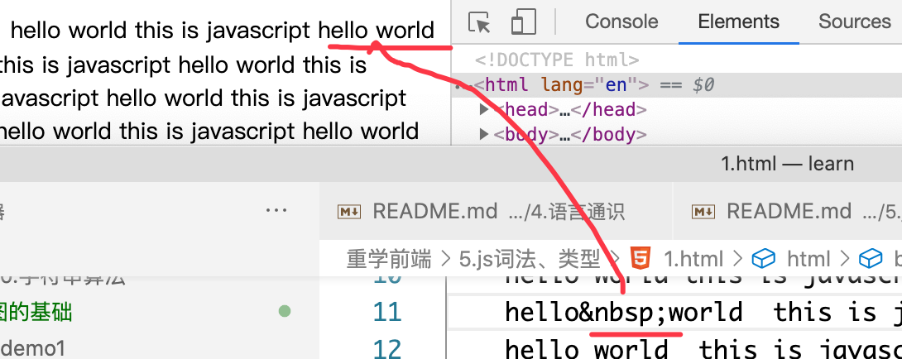
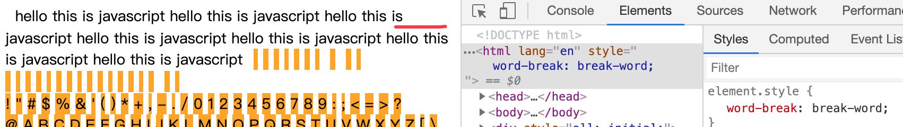

# js 词法、类型

unicode 编码

a 97
A 65

(unicode blocks)[http://www.fileformat.info/info/unicode/block/index.htm]
写个正则，匹配所有的 Number
写一个 utf8_encoding

```
U+000A	LINE FEED (LF) 换行，打字机的纸前进一行
U+0007   "\u0007"  BELL 响一声、即命令行会报警
U+000D  CR CARRiage Return 回车。 打字机指针回到行首
U+0020  SPACE (U+0020) 空格

// 正则判断中文 [\u4e00-\u9fa5] 实际不太准确，因为 CJK 很分散，如下图所示
// CJK 即 china japen koren 中日韩 文
CJK Unified Ideographs	U+4E00	U+9FFF	(20977)
```


BMP 基本字符平面 group 0 的 plane 0 被称作 `Basic Multilingual Plane`, 即 BMP

js 可以很好处理 BMP 内的字符。如果超出就需要 codePointAt 等 API。
http://www.fmddlmyy.cn/text6.html
最早版本的 unicode 所允许的值是 U+0000 to U+FFFF
后来 unicode 扩充了，取值范围变成了 U+0000 to U+10FFFF .
原先的
U+0000 to U+FFFF 这个集合就称作 BMP (Basic Multilingual Plane)

```js
var 厉 = 1; // 文件里放中文可能会导致问题
// 可以用 \u 转义，即 unicode 码的 16进制
// "厉".charCodeAt(0).toString(16);
//"5389";
var \5389 = 1;
```

Punctuator： 标点符号

js 词法

```
// js 文件的输入组成
InputElement
    WhiteSpace 空白符
        TAB U+0009 制表符 \t，在做表格时方便对齐。一般是4个字符,不足4个补足4个，如下，数字会自动对齐
            100 10
            20  33
            3   9
        VT U+0011 纵向制表符 \v
        FF
        SP: U+0020 space
        NBSP: none break space，非断开空格 如果 hello&nbsp;world 这样空间不足时，这两个词总在一起，如下图
        ZWNBSP: zero-width no-break space 零宽非断开空格 0xFEFF 是一个实际不存在的字符，用于判断字节流是大端还是小端
    LineTerminator  换行符
    Comment  注释
    Token
```

关于 nbsp。


```
'\t'.codePointAt(0)
9
```

```
word-break: break-all;  // 如下图，hello被断开了
word-break: break-word;  //默认，是按照每个词来断开的，单个词没有被断开
```




https://www.cnblogs.com/yanze/p/9922894.html
https://www.cnblogs.com/winter-cn/archive/2012/04/17/2454229.html

到 50 分钟
